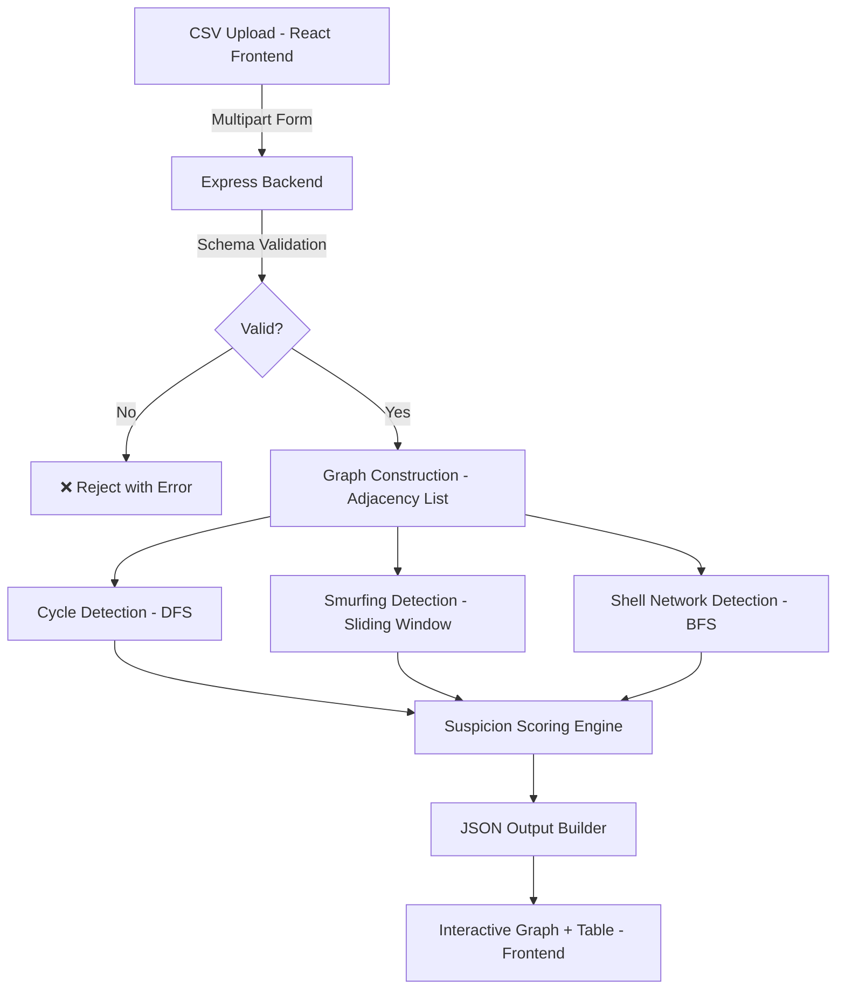

<div align="center">

# 🔍 Fraud Netra

### Graph-Based Financial Crime Detection Engine

[](https://reactjs.org/)
[](https://nodejs.org/)
[](https://expressjs.com/)
[](https://tailwindcss.com/)
[](https://vitejs.dev/)

**Transforming raw transaction data into a structured financial investigation system — detecting money mule networks through graph theory, suspicion scoring, and interactive visualization.**

[🌐 Live Demo](https://rift2026-fraud-netra-dun.vercel.app/) • [⚙️ Backend API](https://fraud-netra-backend.vercel.app/) • [🏆 RIFT 2026 Hackathon](#-rift-2026-hackathon)

</div>

---

## 🔗 Project Links

<table>
<tr>
<td align="center" width="50%">

### 🌐 **Frontend**
[](https://rift2026-fraud-netra-dun.vercel.app/)

[View Live Site →](https://rift2026-fraud-netra-dun.vercel.app/)

</td>
<td align="center" width="50%">

### ⚙️ **Backend API**
[](https://fraud-netra-backend.vercel.app/)

[API Server →](https://fraud-netra-backend.vercel.app/)

</td>
</tr>
</table>

---

## 🎯 Problem Statement

Money muling is a serious financial crime where criminals move illegal money through multiple accounts to obscure its origin. These accounts form **hidden networks** that are nearly impossible to detect with traditional database queries.

<table>
<tr>
<td width="50%">

### 🚨 **The Challenge**

- 💸 **Hidden Networks** — mule accounts are designed to blend in
- 🔍 **Pattern Complexity** — cycles, fans, and shell chains are hard to spot manually
- 📊 **Scale** — thousands of transactions need real-time processing
- ❌ **False Positives** — legitimate merchants get flagged incorrectly
- 🕒 **Speed** — forensic results must be actionable within seconds

</td>
<td width="50%">

### ✅ **Fraud Netra's Solution**

- 🕸️ **Graph Modeling** — every transaction becomes a directed edge
- 🧠 **3 Detection Engines** — cycles, smurfing, and shell networks
- ⚖️ **Suspicion Scoring** — explainable 0–100 risk scores per account
- 🎯 **False Positive Control** — high-activity accounts auto-whitelisted
- ⚡ **<30s Processing** — upload to visual results in under 30 seconds

</td>
</tr>
</table>

---

## 🚀 Key Features

<table>
<tr>
<td width="50%">

### 📥 **CSV Upload & Validation**

- Accepts standard transaction CSV files
- Strict schema validation before processing
- Immediate rejection of invalid formats
- Supports datasets up to 10,000 transactions

### 🕸️ **Interactive Graph Visualization**

- All accounts rendered as interactive nodes
- Directed edges show money flow
- Fraud rings highlighted in distinct colors
- Hover tooltips: account ID, score, patterns

</td>
<td width="50%">

### ⚖️ **Suspicion Scoring Engine**

- Rule-based, fully explainable scores
- Multi-signal aggregation (0–100 scale)
- Sorted by risk for investigator priority
- Per-account pattern breakdown

### 📤 **Structured JSON Export**

- Exact forensic output format
- Suspicious accounts list
- Fraud ring membership details
- Processing summary statistics

</td>
</tr>
</table>

---

## 🧠 Fraud Detection Engine

Fraud Netra detects **three core money muling patterns** using graph algorithms:

---

### 1️⃣ Circular Fund Routing (Cycles)

Money moves in a loop — a classic indicator of a fraud ring.

```
A → B → C → A
```

**Rules:**
- Detect cycles of length **3 to 5** only
- All accounts in a cycle belong to the same ring
- Canonical representation removes duplicate detections

**Algorithm:** Depth-limited DFS with full path tracking

---

### 2️⃣ Smurfing Patterns (Fan-in / Fan-out)

Structured splitting or aggregation of funds to avoid detection.

```
Fan-in:  [X1, X2, ... X10] → Aggregator
Fan-out: Distributor → [Y1, Y2, ... Y10]
```

**Rules:**
- ≥10 unique senders/receivers within a **72-hour window**
- Sliding window applied per timestamp grouping
- Aggregator and all participants flagged as ring members

**Algorithm:** Sorted timestamp grouping + sliding window unique count

---

### 3️⃣ Layered Shell Networks

Money passes through low-activity "shell" intermediary accounts.

```
Source → Shell₁ → Shell₂ → Destination
```

**Rules:**
- Path length ≥ 3 hops
- Intermediate nodes have ≤ 3 total transactions
- BFS traversal up to depth 4

**Algorithm:** BFS with intermediate node activity filtering

---

## 🚫 False Positive Control

To protect legitimate merchants and payroll systems from being flagged:

> **Accounts are automatically whitelisted if:**
> - Transaction count **> 50**
> - Many unique counterparties detected
> - No cycles or smurfing patterns found

This ensures **high precision** and eliminates noise from genuine high-volume accounts.

---

## ⚖️ Suspicion Score Methodology

Each account receives a composite score from **0 to 100** based on detected signals:

| Signal | Score Added |
|---|---|
| 🔴 Cycle member | +40 |
| 🟠 Smurf aggregator | +35 |
| 🟡 Shell intermediate | +30 |
| 🟡 Smurf participant | +20 |
| 🔵 High velocity transfer | +15 |
| 🔵 Large suspicious amount | +10 |

> Score is **capped at 100**. Accounts are sorted in **descending order** for investigator priority.

---

## 📊 System Output

### 1️⃣ Interactive Graph
- Nodes = Accounts, Edges = Transactions (directed)
- Fraud rings visually grouped and color-coded
- Suspicious nodes visually distinct from normal ones
- Hover for: `account_id`, `suspicion_score`, `detected_patterns`

### 2️⃣ JSON Forensic Export (Strict Format)

```json
{
  "suspicious_accounts": [
    {
      "account_id": "ACC_001",
      "suspicion_score": 85.0,
      "detected_patterns": ["cycle_member", "smurf_aggregator"],
      "ring_id": "RING_001"
    }
  ],
  "fraud_rings": [
    {
      "ring_id": "RING_001",
      "member_accounts": ["ACC_001", "ACC_002", "ACC_003"],
      "pattern_type": "circular_routing",
      "risk_score": 90.0
    }
  ],
  "summary": {
    "total_accounts_analyzed": 500,
    "suspicious_accounts_flagged": 12,
    "fraud_rings_detected": 3,
    "processing_time_seconds": 4.2
  }
}
```

### 3️⃣ Fraud Ring Summary Table

| Ring ID | Pattern Type | Member Count | Risk Score | Members |
|---|---|---|---|---|
| RING_001 | Circular Routing | 3 | 90.0 | ACC_001, ACC_002, ACC_003 |
| RING_002 | Smurfing (Fan-in) | 11 | 75.0 | AGG_01, P01, P02... |

---

## 📥 Input Specification

The uploaded CSV must contain **exactly** these columns:

| Column | Type | Description |
|---|---|---|
| `transaction_id` | String | Unique transaction identifier |
| `sender_id` | String | Sending account ID |
| `receiver_id` | String | Receiving account ID |
| `amount` | Float | Transaction amount |
| `timestamp` | `YYYY-MM-DD HH:MM:SS` | Transaction datetime |

> ⚠️ Invalid schemas are **immediately rejected** with a clear error message.

---

## 🛠️ Tech Stack

### **Frontend**
<p>


</p>

### **Backend**
<p>


</p>

### **Processing & Deployment**
<p>


</p>

---

## 📁 Architecture Overview



### **Design Principles**

- **Stateless Processing** — no database, every request is self-contained
- **In-Memory Graph** — adjacency list for O(E) construction
- **Depth-Limited Traversal** — prevents runaway computation on dense graphs
- **Explainable Scoring** — every point added has a named reason

---

## 📂 Project Structure

```
root
├─ 🔧 backend/
│  ├─ server.js                  # Express entry point
│  ├─ routes/
│  │  └─ detect.js               # Upload & detection route
│  ├─ engine/
│  │  ├─ graphBuilder.js         # CSV → adjacency list
│  │  ├─ cycleDetector.js        # DFS-based cycle detection
│  │  ├─ smurfDetector.js        # Fan-in / fan-out detection
│  │  ├─ shellDetector.js        # BFS shell chain detection
│  │  └─ scorer.js               # Suspicion score aggregator
│  ├─ utils/
│  │  ├─ csvValidator.js         # Schema validation
│  │  └─ outputBuilder.js        # JSON output formatter
│  └─ package.json
│
└─ 💻 frontend/
   ├─ src/
   │  ├─ components/
   │  │  ├─ UploadPanel.jsx       # CSV upload UI
   │  │  ├─ GraphView.jsx         # react-force-graph-2d visualization
   │  │  ├─ RingTable.jsx         # Fraud ring summary table
   │  │  └─ JsonExport.jsx        # Download JSON report
   │  ├─ pages/
   │  │  └─ Home.jsx
   │  ├─ App.jsx
   │  └─ main.jsx
   └─ package.json
```

---

## ⏱️ Performance & Targets

### **Complexity**

| Operation | Complexity |
|---|---|
| Graph Construction | O(E) |
| Cycle Detection (depth-limited DFS) | Manageable up to 10k edges |
| Smurf Detection (sliding window) | O(E) |
| Shell Detection (BFS, depth 4) | O(V + E) |

### **Performance Targets**

| Metric | Target |
|---|---|
| ⚡ Upload → Results | **≤ 30 seconds** |
| 📊 Max Dataset Size | **10,000 transactions** |
| 🎯 Precision | **≥ 70%** |
| 📡 Recall | **≥ 60%** |

---

## 🚀 Local Setup

### 📋 Prerequisites
-  **Node.js 18+**
-  **npm**

### ⚙️ Backend

```bash
cd backend
npm install
node server.js
```

Expected output:
```bash
✅ Server running on port 5000
```

### 💻 Frontend

```bash
cd frontend
npm install
npm run dev
```

Open: `http://localhost:5173`

---

## 📖 Usage Guide

1. 📁 **Upload** your transaction CSV file
2. ▶️ Click **"Run Detection"**
3. 🕸️ **Explore** the interactive graph — hover nodes for details
4. 📋 **Review** the fraud ring summary table
5. 📥 **Download** the structured JSON investigation report

> No login required. The application is fully publicly accessible.

---

## ⚠️ Known Limitations

- Optimized for datasets up to **10,000 transactions**
- Extremely dense graphs may reduce **visualization render speed**
- Complex long-term laundering chains may require extended analysis windows
- Detection precision depends on **pattern clarity** within the dataset

---

## 🏆 RIFT 2026 Hackathon

This project was built for the **RIFT 2026 Hackathon — Money Muling Detection Challenge**.

Fraud Netra satisfies all evaluation requirements:
- ✅ CSV upload with schema validation
- ✅ Directed graph construction
- ✅ Detection of cycles, smurfing, and shell networks
- ✅ Suspicion scoring (0–100, explainable)
- ✅ Interactive graph visualization
- ✅ Exact JSON output format
- ✅ Live deployed frontend + backend

---

## 👥 Team Innov8ors

<table>
<tr>
<td align="center" width="25%">

**Harsh Kulkarni**
System Design & GitHub

</td>
<td align="center" width="25%">

**Abhishek Kalimath**
Full Stack Development

</td>
<td align="center" width="25%">

**Yash Lawande**
AI Integration

</td>
<td align="center" width="25%">

**Sarthak Manke**
LLM & Prompt Engineering

</td>
</tr>
</table>

---

## 📜 Scripts

### Backend
```bash
node server.js     # Start production server
npm run dev        # Start with nodemon (if configured)
```

### Frontend
```bash
npm run dev        # Start Vite dev server
npm run build      # Build for production
npm run preview    # Preview production build
npm run lint       # Run ESLint
```

---

<div align="center">

### 🔍 Fraud Netra — Exposing Hidden Networks, One Graph at a Time

**Made with 💙 by Team Innov8ors**

**RIFT 2026 | Money Muling Detection Challenge 🏆**

---

*Last Updated: February 2026*

</div>
